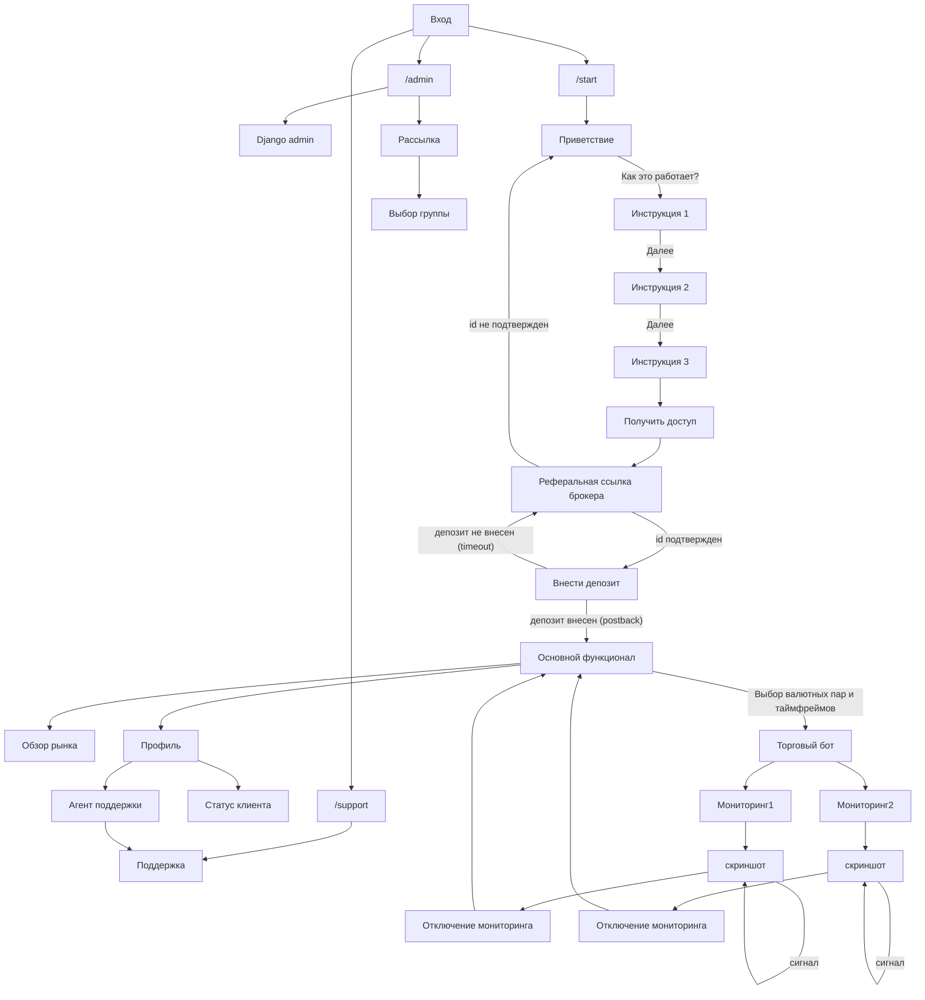

# Диаграмма взаимодействия



## Регистрация и депозит

К реферальной ссылке брокера прикрепляется user_id телеграм профиля + информация переданная через параметр start ссылки
на бота.

```
# Ссылка на бота
https://t.me/brarfhggxqncubot?start=реферальные_данные

# Ссылка на брокера
https://broker-link.com?partner_id=123&subid=user_id+реферальные_данные
```

Сервер брокера должен вернуть постбэки с этими данными. По ним будет наиден профиль пользователя в базе данных, в
котором будет отмечен его статус регистрации или депозита в зависимости от постбэка.